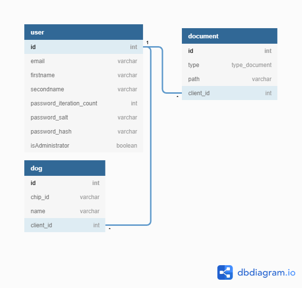
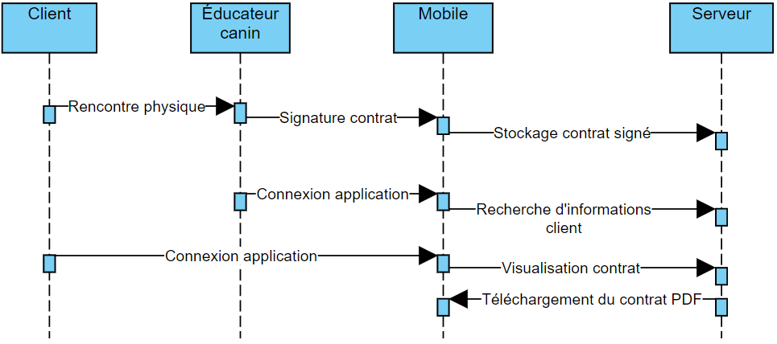
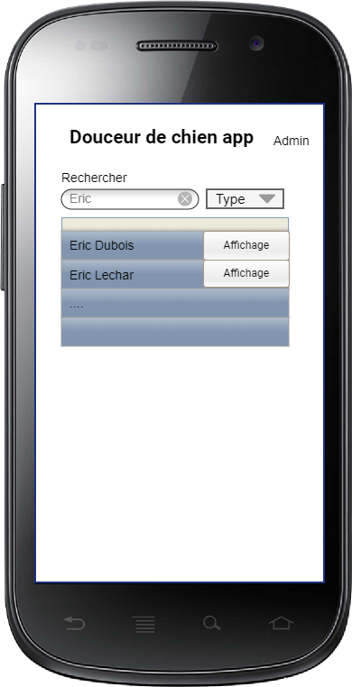
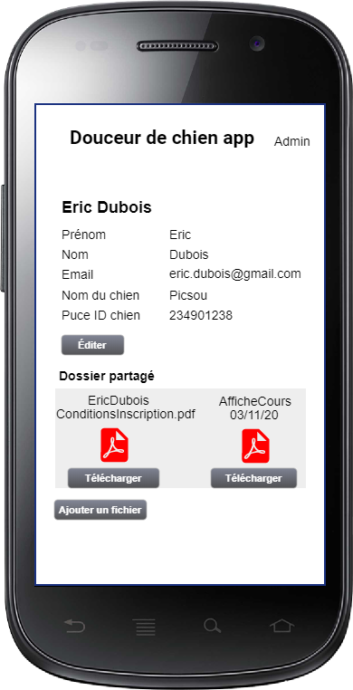
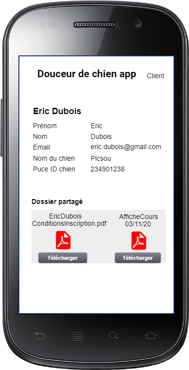

# Cahier des charges

## Douceur de chien Features app

## Description

L'application mobile permet à un éducateur canin ou à un client de se connecter à l'application pour avoir accès à différentes fonctionnalités.
L'éducateur canin a accès à une liste contenant tous ses actuels clients ainsi que leurs différentes informations, telle que :

* Les informations personnelles du client
* Les informations personnelles du chien
* Les contrats signés du client 

Le client quant à lui peut s'enregistrer au préalable sur l'application ou directement avec l'éducateur canin lors de leur première rencontre.
De ce fait, l'éducateur canin pourra faire signer directement les différents contrats au client avec un smartphone ou une tablette.

Le client aura également la possibilité de se connecter afin de consulter ses informations personnelles et ses différents contrats signés.

## Modèle de données

## Liste des fonctionnalités

#### Éducateur canin

* Connexion
  * Ajout d'un client
  * Recherche d'un client
    * Affichage des informations d'un client 
    * Signature de contrat client en direct
    * Ajout de fichier sur le dossier partagé

#### Client

* Inscription
  * Identifiant
  * Mot de passe
  * Adresse email
* Connexion
  * Affichage des informations 
  * Accès aux fichiers sur le dossier partagé

## Liste des fonctionnalités en mode offline

#### Éducateur canin et client

* Information du client
* Fichier(s) dans le dossier partagé

## Mode offline fonctionnement
##### Méthode de stockage

Local Storage

##### Diagramme de séquence

##### Scénarios

1. Rendez-vous au préalable indépendamment de l'application
2. Rencontre physique entre l'éducateur canin et le client
   1. Si première rencontre, alors création du compte client
3. Complétion des informations du contrat ainsi que de la signature depuis l'application
4. Ajout dans le dossier partagé de l'éducateur et du client
5. Téléchargement du contrat PDF depuis le dossier partagé

## Maquettes de l'application
#### Utilisateur

#### Éducateur canin

#### Client

## Listes des tâches par priorité

| **Tâches**                                                                                                                | **Priorité** | **Estimation de temps en période** |
|---------------------------------------------------------------------------------------------------------------------------|--------------|------------------------------------|
| Publication                                                                                                               | 6            | 8                                  |
| Créer la base de données                                                                                                  | 3            | 2                                  |
| Créer la page d'inscription                                                                                               | 5            | 4                                  |
| Créer la page de connexion                                                                                                | 4            | 2                                  |
| Créer la page de recherche d'utilisateur pour les administrateurs                                                         | 7            | 2                                  |
| Créer la page de consultation des informations de l'utilisateur pour client et administrateur \(info \+ fichier partagé\) | 2            | 12                                 |
| Créer la page d'édition du client                                                                                         | 8            | 2                                  |
| Créer la page de création de contrat                                                                                      | 1            | 8                                  |
| Tests et résolution de bugs                                                                                               | 9            | 8                                  |

## Planning

## Matériel et logiciel

- Ordinateur Windows 10
- IDE (Visual Studio Code)
- Outil de versioning de code (GIT avec repository en ligne sur GitHub)
- Outil bureautique (Typora)
- Éditeur de diagramme ([Visual Paradigm Online](https://online.visual-paradigm.com/fr/))
- Éditeur de base de données ([dbdiagram.io](https://dbdiagram.io/home))
- Éditeur de maquette ([Pencil](https://pencil.evolus.vn/))

## Librairies utilisées

* Création de pdf en PHP ([TCPDF](https://tcpdf.org/examples/))
* Dessiner dans un canevas ([responsive-sketchpad](https://github.com/tsand/responsive-sketchpad))
* Encryption de mot de passe ([PBKDF2](https://github.com/padloc/cordova-plugin-pbkdf2))

